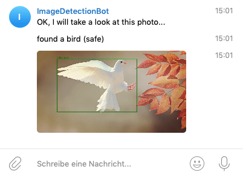

# imagedetectionbot
telegram bot detecting objects in images

A running instance of this bot can be found here:
[https://t.me/ImageDetectionBot](https://t.me/ImageDetectionBot)

Example

To get this bot working on your machine, you can use the docker-compose configuration. You will need docker installed for this.

First create a bot using telegrams [botfather](https://t.me/BotFather). It is really simple. You will need the token generated.

Create a file .env in the root-dir of this checkout with this content:

`BOT_TOKEN=[yourBotToken]`

Replace [yourBotToken] with the bot token you got from telegram.
 
Initialize the application running this command:

`docker-compose -f docker-compose-install.yaml up`

It will take a while to download all data.

Start a daemon running the bot

`docker-compose up -d`
